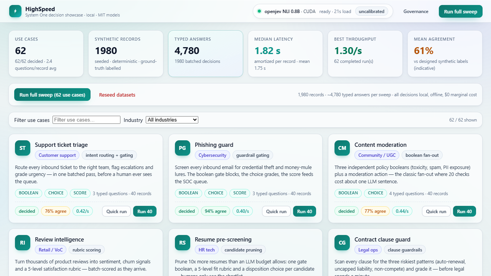
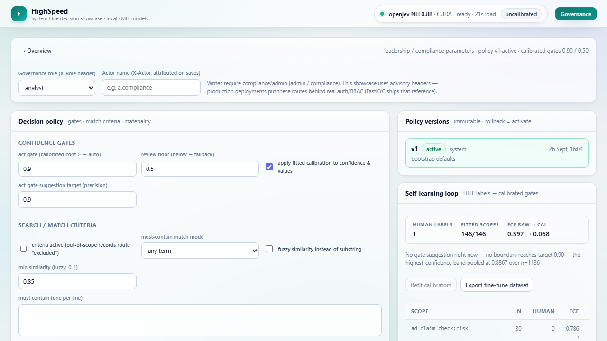

# HighSpeed — a System One decision engine showcase

**62 real-world decision workloads, decided locally by a 0.8B open-source model, in one batched pass each — no LLM chat, no API key, no per-token cost.**

HighSpeed is a runnable, self-contained web app that demonstrates what a **System One
decision model** ([openjev NLI 0.8B](https://openjev.tech), MIT) is actually good for:
cheap, fast, typed micro-decisions — triage, gating, routing, rubric scoring — at a price
and latency that a generative LLM can't reach. Each use case asks **typed questions**
(boolean / noul / choice / score) about a batch of records; the model answers every
question for every record in a single forward pass per batch.

The app is deliberately honest: every number on the dashboard is measured live (latency,
throughput, agreement against designed ground truth), the engine is labelled as
uncalibrated raw softmax until the built-in calibration layer has data, and the synthetic
datasets ship with designed labels so you can verify behavior yourself.



## Why this matters

A single LLM "classify this ticket" call costs a sentence of generation per field, per
record. HighSpeed answers ~2–4 typed questions per record for a whole batch of records in
one request — measured **~0.5–1.3 records/second and ~1–2 s median amortized latency per
record on a consumer GPU**, for $0 marginal cost, fully offline. That is the System One
wedge: reserve generative models for generation; use decision heads for decisions.

## What's inside

- **62 use cases** across AI safety, security, devtools/SRE, support/CX, commerce, finance,
  insurance, health, legal/privacy, HR, media, marketing and manufacturing/logistics —
  each a synthetic dataset (30–40 records) with designed ground truth and a typed question
  schema (booleans, choices, 0–10 score rubrics).
- **Batched runner** — warm-singleton engine, batched `states/questions` requests,
  per-record amortized latency and throughput, strict *and* tolerant agreement metrics.
- **Governance (leadership/compliance parameters)** — versioned, immutable policy:
  confidence gates, search/match criteria (must-contain / must-not-contain terms, substring
  or fuzzy similarity), materiality bands (below-floor auto-dispose, forced human review
  above a review amount), per-use-case overrides. Every run stamps the policy version it
  executed under. *(In this showcase the governance role is an advisory `X-Role` header —
  production deployments should put these routes behind real auth/RBAC.)*
- **Self-learning loop** — decisions + labels → fitted **calibrators** (binned monotone
  reliability maps + learned value bias per question) → calibrated confidence drives
  act/review/fallback routing and learned bias corrects model values. Human-in-the-loop
  labels override ground truth; measured ECE is shown raw → calibrated; when the calibrated
  evidence supports it, the app proposes a gate adjustment you can apply as a new policy
  version. `GET /api/learning/export` downloads a JSONL fine-tuning dataset for the engine.
- **Exports** — per-use-case CSV (values, raw + calibrated confidence, routing, ground
  truth, match flags) for offline analysis.



## Quick start (Windows)

```powershell
launcher.bat
```

The launcher creates the venv, installs dependencies, builds the React frontend, migrates
and seeds the database (62 datasets, ~1,980 records), warms the engine in the background,
auto-runs the first use cases, and serves everything on **http://127.0.0.1:8010** —
the UI and the API share one port.

Requirements: Python 3.11+, Node/npm (for the one-time UI build), and the openjev model
weights — see **[models/README.md](models/README.md)**. Without a CUDA GPU it falls back
to the CPU profile automatically (same contract, slower).

## Architecture

```
launcher.bat
  -> venv + deps + React build -> migrate -> seed (62 datasets, ~1,980 records)
  -> Django on 127.0.0.1:8010 (REST API + built SPA, single port)

backend/
  config/engines.json          engine catalogue (models_dir is env-overridable)
  systemone_vendor/            vendored decision-client (systemone_client.py)
  showcase/
    models.py      Record / ShowcaseRun / Decision / PolicyConfig / Feedback / Calibration
    services/
      engine.py    warm System One singleton (GPU -> CPU fallback)
      registry.py  12 hand-built use cases + pack merge (62 total)
      packs_a-d.py 50 spec-driven packs: payload pools, NLI-authored schemas, ground truth
      datasets.py  deterministic synthetic generators (designed ground truth)
      policy.py    versioned gates + match criteria + materiality (+ per-use-case overrides)
      learning.py  labels -> reliability fit + value bias -> calibrated routing, suggestions
      runner.py    batched decide_many -> policy + calibration -> decisions + agreement
      jobs.py      background runs (single use case / full sweep / auto-run)

frontend/        React + TypeScript: Overview (KPIs, 62-card grid, filters, sweep control),
                 UseCase page (records/results, probability drill-down, HITL label controls),
                 Governance page (policy editor, version rollback, learning panel)
```

## API (all under `/api`)

| Method | Path | Purpose |
|---|---|---|
| GET | `/health`, `/engine`, `/stats` | service, engine + global KPIs |
| GET | `/usecases` · `/usecases/<key>` | registry summaries · full detail |
| POST | `/usecases/<key>/run` · `/runs/all` | decide one use case / full sweep (background) |
| GET | `/runs/latest` · `/runs/<id>` | progress / results |
| GET · POST | `/policy` · `/policy/activate/<v>` | read · save new version (write: `X-Role: compliance\|admin`) |
| GET · POST | `/feedback` | list / post a human label (`X-Role: analyst+`, refits the calibrator) |
| GET | `/learning` | calibrators (ECE raw→calibrated), suggestions, recent labels |
| POST | `/learning/refit` · `/learning/apply` | refit · promote a suggestion/patch to a policy version |
| GET | `/learning/export` | JSONL fine-tuning dataset |
| GET | `/usecases/<key>/export.csv` | decisions + ground truth + match flags |
| POST | `/actions/reseed` | regenerate datasets (wipes decisions/runs) |

## Tests & smoke

```powershell
cd backend
..\.venv\Scripts\python manage.py test showcase   # 44 tests: registry/schema validity for all
                                                  # 62 use cases, generator determinism,
                                                  # agreement math, mocked-engine runner,
                                                  # policy/criteria/materiality, learning fit,
                                                  # governance API role gates
pwsh -File scripts\api_smoke.ps1                  # live API smoke against a running server
```

## Honest limits

- Engine confidence is **raw softmax**; the fitted calibration layer only engages after
  ≥10 labelled pairs per question and is indicative on small n. Validate ECE on your own
  traffic before raising automation thresholds.
- Agreement numbers are measured against **designed synthetic labels** — they demonstrate
  mechanics and hypothesis-authoring quality, not benchmark accuracy.
- Runs execute as in-process threads (SQLite demo); production would use a queue/worker.
- Not for: open-ended generation, multi-hop reasoning, >64 options, non-Latin text on the
  English engine, states beyond 4096 tokens.
- Role headers on governance writes are advisory (open local showcase); put them behind
  real authentication for production.

## License

MIT — see [LICENSE](LICENSE). The openjev model weights are MIT-licensed as well; the
vendored decision client (`backend/systemone_vendor/systemone_client.py`) comes from the
System One project under the same license.

Grounded in the public docs: docs.typesafe.ai · jevtypesafe.org · openjev.tech ·
systemonemodels.org
